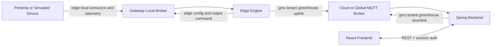

# GMS Firmware Workspace

Firmware-side workspace for gateway and zone devices.

## Folder Structure

- `src/gateway/` - gateway stack (broker, edge engine, simulator/cluster manager)
- `src/portenta/` - real Portenta firmware
- `src/wifi_updater/` - WiFi/TLS updater utility firmware

## Identity Model

`tenant -> greenhouse (gateway scope) -> zone (Portenta device)`

## Integration Flow



## Topic Families

### Local edge topics (device <-> gateway)

- `edge/{greenhouse}/zone/{device}/registry/announce`
- `edge/{greenhouse}/zone/{device}/telemetry/raw`
- `edge/{greenhouse}/zone/{device}/config`
- `edge/{greenhouse}/zone/{device}/command/output`

### Backend-facing topics (gateway <-> backend)

- `gms/{tenant}/{greenhouse}/uplink/telemetry`
- `gms/{tenant}/{greenhouse}/uplink/registry`
- `gms/{tenant}/{greenhouse}/uplink/status`
- `gms/{tenant}/{greenhouse}/uplink/command_ack`
- `gms/{tenant}/{greenhouse}/uplink/alert`
- `gms/{tenant}/{greenhouse}/downlink/registry`
- `gms/{tenant}/{greenhouse}/downlink/command`
- `gms/{tenant}/{greenhouse}/downlink/threshold`

## Gateway Operation Modes

### Single gateway mode

```bash
cd firmware/src/gateway
./scripts/up.sh
# or hardware-only
./scripts/up-prod.sh
```

- Cloud/global broker exposed on `localhost:1883`
- Local greenhouse broker exposed on `localhost:18831`
- Simulator UI (if enabled) on `localhost:4173`

### Cluster simulation mode

```bash
cd firmware/src/gateway
./scripts/up-cluster.sh
```

- Cluster manager UI on `localhost:4173`
- Shared cloud broker on `localhost:1883` (for edge -> backend)
- Each simulated gateway gets an auto-assigned unique local MQTT host port (starting around `18831`)

## Hardware Safety Rule (Important)

Portenta devices must connect only to a gateway local broker endpoint (`MQTT_BROKER` + `MQTT_PORT`), never directly to a public/cloud broker.

The Portenta firmware enforces a local-only broker policy:

- allows private IPv4 (`10.x`, `172.16-31.x`, `192.168.x`), link-local, loopback
- allows `localhost` and `.local` hostnames
- rejects public broker hosts

## Quick Start (Integrated)

From repository root:

```bash
cd firmware/src/gateway
./scripts/up-prod.sh

cd ../../../backend/infra
./scripts/up.sh

cd ../../frontend/frontend
npm run dev
```

Open:

- Frontend greenhouse page: `http://localhost:5173/g`
- Gateway cluster manager: `http://localhost:4173` (only in cluster/simulator mode)

## Helper Scripts

From `firmware/src/gateway`:

```bash
./scripts/clean-containters.sh
./scripts/verify-ports.sh
```

- `clean-containters.sh` removes known stale gateway/simulator containers that can keep old brokers alive.
- `verify-ports.sh` reports listeners on `1883`, `18831`, `18832`, and `4173` before or after switching modes.

## Environment Alignment Rules

- `TENANT_ID` + `GREENHOUSE_ID` on gateway containers must match backend greenhouse records.
- Portenta `GREENHOUSE_ID` must match the selected gateway greenhouse.
- Every Portenta `DEVICE_ID` must be unique per greenhouse.

## Contract Reference

- `../backend/backend/docs/zones-mqtt-v1.md`
