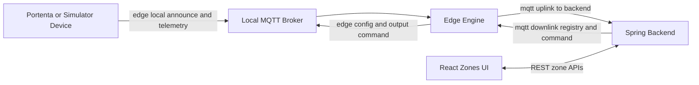

# GMS Firmware Workspace

Firmware-side workspace for gateway and zone devices.

## Folder Structure

- `src/gateway/` - gateway stack (broker, edge engine, simulator)
- `src/portenta/` - real Portenta firmware
- `src/wifi_updater/` - WiFi/TLS updater utility firmware

## Identity Model

`tenant -> greenhouse (gateway scope) -> zone (Portenta device)`

## Integration Flow



## Topic Families and Meaning

### Local edge topics (device <-> gateway)

- `edge greenhouse zone device registry announce` - device heartbeat/discovery metadata
- `edge greenhouse zone device telemetry raw` - raw sensor payload from zone
- `edge greenhouse zone device config` - gateway-applied zone assignment for device
- `edge greenhouse zone device command output` - low-level actuator command (`channel`, `state`)

### Backend-facing topics (gateway <-> backend)

- `gms tenant greenhouse uplink telemetry` - normalized metrics to backend
- `gms tenant greenhouse uplink registry` - discovery and registry state events
- `gms tenant greenhouse uplink status` - gateway online/offline state
- `gms tenant greenhouse uplink command_ack` - command status feedback
- `gms tenant greenhouse downlink registry` - assign/unassign/full sync commands
- `gms tenant greenhouse downlink command` - semantic device commands

Metric payloads are numeric and include both analog sensor keys and binary IO keys (`din_*`, `dout_*`).

## Quick Start (Integrated)

From repository root:

```bash
cd firmware/src/gateway
./scripts/up.sh

cd ../../../backend/infra
./scripts/up.sh

cd ../../frontend/frontend
npm run dev
```

Follow backend logs while starting:

```bash
cd backend/infra
./scripts/up.sh -v
```

Open:

- Zones UI: `http://localhost:5173/zones`
- Simulator UI: `http://localhost:4173`

## Environment Alignment Rules

Keep these values aligned across frontend/backend/gateway/portenta:

- tenant id
- greenhouse id

Each device id must be unique per greenhouse.

## Contract Reference

- `../backend/backend/docs/zones-mqtt-v1.md`
